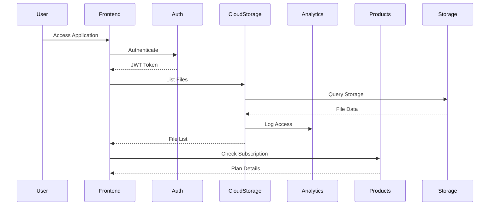

# SortedStorage - Design Document

## 1. System Architecture

### 1.1 High-Level Architecture
```
┌─────────────────────────────────────────────────────────────┐
│                     SortedStorage Frontend                  │
│                        (SvelteKit App)                      │
├─────────────────────────────────────────────────────────────┤
│                         API Gateway                         │
│                    (Solobase Router/Proxy)                  │
├──────────────┬──────────────┬──────────────┬───────────────┤
│   CloudStorage│   Analytics  │   Products   │     Auth      │
│   Extension   │   Extension  │   Extension  │    System     │
├──────────────┴──────────────┴──────────────┴───────────────┤
│                      Solobase Core                          │
│              (Database, Storage, Services)                  │
├─────────────────────────────────────────────────────────────┤
│   PostgreSQL/SQLite    │    S3/Local Storage                │
└─────────────────────────────────────────────────────────────┘
```

### 1.2 Component Interaction Flow


## 2. Frontend Design

### 2.1 Technology Stack
- **Framework**: SvelteKit 2.0
- **UI Library**: Custom components extracted from Solobase admin
- **Styling**: TailwindCSS 3.x
- **Icons**: Lucide Icons
- **State Management**: Svelte Stores + Context API
- **HTTP Client**: Native Fetch with interceptors
- **File Handling**: HTML5 File API + Streams

### 2.2 Project Structure
```
sortedstorage/
├── src/
│   ├── lib/
│   │   ├── components/       # Reusable UI components
│   │   │   ├── common/       # Extracted from Solobase
│   │   │   ├── storage/      # Storage-specific
│   │   │   └── layout/       # Layout components
│   │   ├── stores/          # Svelte stores
│   │   ├── services/        # API services
│   │   ├── utils/           # Helper functions
│   │   └── types/           # TypeScript types
│   ├── routes/
│   │   ├── +layout.svelte   # App layout
│   │   ├── +page.svelte     # Home/Dashboard
│   │   ├── auth/            # Auth pages
│   │   ├── files/           # File management
│   │   ├── shared/          # Shared files
│   │   ├── settings/        # User settings
│   │   └── upgrade/         # Subscription
│   └── app.html
├── static/
│   ├── images/
│   └── styles/
└── package.json
```

### 2.3 UI Component Library

#### Core Components (from Solobase admin)
```typescript
// Button Component
interface ButtonProps {
  variant: 'primary' | 'secondary' | 'ghost' | 'danger'
  size: 'sm' | 'md' | 'lg'
  loading?: boolean
  disabled?: boolean
  icon?: string
}

// Card Component
interface CardProps {
  title?: string
  subtitle?: string
  actions?: Action[]
  glass?: boolean // Glass morphism effect
}

// Modal Component
interface ModalProps {
  open: boolean
  title: string
  size: 'sm' | 'md' | 'lg' | 'xl'
  closable?: boolean
}

// Table Component
interface TableProps {
  columns: Column[]
  data: any[]
  sortable?: boolean
  selectable?: boolean
  pagination?: PaginationConfig
}
```

#### Storage-Specific Components
```typescript
// FileExplorer Component
interface FileExplorerProps {
  files: FileItem[]
  folders: FolderItem[]
  view: 'grid' | 'list'
  onSelect: (items: Item[]) => void
  onAction: (action: string, item: Item) => void
}

// UploadManager Component
interface UploadManagerProps {
  maxFileSize: number
  allowedTypes: string[]
  multiple: boolean
  onUpload: (files: File[]) => Promise<void>
}

// StorageMeter Component
interface StorageMeterProps {
  used: number
  total: number
  unit: 'GB' | 'TB'
  showUpgrade?: boolean
}

// ShareDialog Component
interface ShareDialogProps {
  item: FileItem | FolderItem
  onShare: (settings: ShareSettings) => Promise<void>
}
```

### 2.4 State Management

#### Global Stores
```typescript
// Auth Store
interface AuthStore {
  user: User | null
  isAuthenticated: boolean
  login: (credentials: LoginCredentials) => Promise<void>
  logout: () => Promise<void>
  refresh: () => Promise<void>
}

// Storage Store
interface StorageStore {
  files: FileItem[]
  folders: FolderItem[]
  currentPath: string
  usage: StorageUsage
  loadFiles: (path: string) => Promise<void>
  uploadFiles: (files: File[]) => Promise<void>
  deleteItems: (items: Item[]) => Promise<void>
}

// Subscription Store
interface SubscriptionStore {
  plan: SubscriptionPlan
  usage: UsageMetrics
  limits: PlanLimits
  checkUpgrade: () => boolean
  initializeCheckout: (planId: string) => Promise<string>
}
```

### 2.5 Routing Strategy

```typescript
// Route Guards
const protectedRoutes = ['/files', '/shared', '/settings', '/upgrade']
const publicRoutes = ['/auth/login', '/auth/register', '/auth/forgot']

// Route Structure
routes/
├── +layout.ts         // Load user, check auth
├── +page.ts          // Redirect to /files if authenticated
├── auth/
│   ├── login/        // Public
│   ├── register/     // Public
│   └── logout/       // Protected
├── files/
│   ├── +page.ts      // Load files for current path
│   └── [...path]/    // Dynamic folder navigation
├── shared/
│   ├── +page.ts      // Load shared items
│   └── [id]/         // Public share access
├── settings/
│   ├── profile/      // User profile
│   ├── security/     // Security settings
│   └── billing/      // Subscription management
└── upgrade/          // Upgrade flow
```

## 3. Backend Integration

### 3.1 API Service Layer

```typescript
// Base API Service
class APIService {
  private baseURL = import.meta.env.VITE_API_URL
  private token: string | null = null

  async request(endpoint: string, options?: RequestInit) {
    const response = await fetch(`${this.baseURL}${endpoint}`, {
      ...options,
      headers: {
        'Authorization': `Bearer ${this.token}`,
        'Content-Type': 'application/json',
        ...options?.headers
      }
    })
    
    if (!response.ok) {
      throw new APIError(response.status, await response.json())
    }
    
    return response.json()
  }
}

// Storage Service
class StorageService extends APIService {
  async listFiles(path: string) {
    return this.request(`/api/storage/files?path=${path}`)
  }
  
  async uploadFile(file: File, path: string) {
    const formData = new FormData()
    formData.append('file', file)
    formData.append('path', path)
    
    return this.request('/api/storage/upload', {
      method: 'POST',
      body: formData,
      headers: {} // Let browser set Content-Type
    })
  }
  
  async createShare(itemId: string, settings: ShareSettings) {
    return this.request('/api/shares', {
      method: 'POST',
      body: JSON.stringify({ itemId, ...settings })
    })
  }
}
```

### 3.2 WebSocket Integration (Future)

```typescript
// Real-time Updates
class RealtimeService {
  private ws: WebSocket
  
  connect() {
    this.ws = new WebSocket(`wss://${host}/ws`)
    
    this.ws.on('storage:update', (data) => {
      // Update file list
    })
    
    this.ws.on('quota:exceeded', (data) => {
      // Show upgrade prompt
    })
  }
}
```

## 4. Data Models

### 4.1 Frontend Models

```typescript
// User Model
interface User {
  id: string
  email: string
  name: string
  avatar?: string
  role: 'user' | 'admin'
  subscription: SubscriptionPlan
  createdAt: Date
}

// File Model
interface FileItem {
  id: string
  name: string
  path: string
  size: number
  mimeType: string
  thumbnailUrl?: string
  isShared: boolean
  permissions: Permission[]
  createdAt: Date
  modifiedAt: Date
  owner: {
    id: string
    name: string
  }
}

// Folder Model
interface FolderItem {
  id: string
  name: string
  path: string
  itemCount: number
  size: number
  isShared: boolean
  permissions: Permission[]
  createdAt: Date
  modifiedAt: Date
}

// Share Model
interface Share {
  id: string
  itemId: string
  itemType: 'file' | 'folder'
  shareType: 'public' | 'user'
  permissions: SharePermission[]
  expiresAt?: Date
  password?: boolean
  accessCount: number
  maxAccess?: number
  createdAt: Date
}

// Subscription Model
interface SubscriptionPlan {
  id: string
  name: 'free' | 'pro' | 'business'
  storageLimit: number
  bandwidthLimit: number
  features: string[]
  price: number
  interval: 'monthly' | 'yearly'
  status: 'active' | 'cancelled' | 'past_due'
}
```

### 4.2 API Response Models

```typescript
// Paginated Response
interface PaginatedResponse<T> {
  data: T[]
  pagination: {
    page: number
    pageSize: number
    total: number
    totalPages: number
  }
}

// Storage Usage Response
interface StorageUsageResponse {
  used: number
  total: number
  breakdown: {
    images: number
    documents: number
    videos: number
    other: number
  }
  trend: {
    daily: number[]
    weekly: number[]
  }
}

// Upload Response
interface UploadResponse {
  id: string
  url: string
  thumbnailUrl?: string
  size: number
  mimeType: string
}
```

## 5. Security Design

### 5.1 Authentication Flow
```
1. User enters credentials
2. Frontend sends to /api/auth/login
3. Solobase validates credentials
4. Returns JWT token + refresh token
5. Frontend stores in httpOnly cookie
6. All requests include Authorization header
7. Token refresh before expiry
```

### 5.2 Authorization Model
```typescript
// Permission Types
enum Permission {
  READ = 'read',
  WRITE = 'write',
  DELETE = 'delete',
  SHARE = 'share',
  ADMIN = 'admin'
}

// Access Control
interface AccessControl {
  resource: string
  permissions: Permission[]
  conditions?: {
    ownership?: boolean
    shareExpiry?: Date
    ipWhitelist?: string[]
  }
}
```

### 5.3 Security Measures
- HTTPS everywhere
- CSRF protection
- Rate limiting
- Input validation
- XSS prevention
- SQL injection prevention (via Solobase)
- File type validation
- Virus scanning (future)

## 6. Performance Optimization

### 6.1 Frontend Optimization
- Code splitting by route
- Lazy loading components
- Image optimization (WebP, AVIF)
- Virtual scrolling for large lists
- Service Worker caching
- Prefetching on hover
- Debounced search
- Optimistic UI updates

### 6.2 Backend Optimization
- Database indexing
- Query optimization
- Redis caching layer
- CDN for static assets
- Chunked file uploads
- Parallel processing
- Background jobs
- Connection pooling

### 6.3 Storage Optimization
- Progressive image loading
- Thumbnail generation
- Compression before upload
- Deduplication
- Tiered storage (hot/cold)
- Lazy loading folder contents

## 7. Responsive Design

### 7.1 Breakpoints
```css
/* Mobile First Approach */
sm: 640px   /* Tablet portrait */
md: 768px   /* Tablet landscape */
lg: 1024px  /* Desktop */
xl: 1280px  /* Large desktop */
2xl: 1536px /* Extra large */
```

### 7.2 Mobile Adaptations
- Bottom navigation
- Swipe gestures
- Touch-friendly buttons
- Simplified layouts
- Contextual menus
- Full-screen modals

## 8. Theme System

### 8.1 Design Tokens
```css
:root {
  /* Colors */
  --color-primary: #5b3df5;
  --color-secondary: #22d3ee;
  --color-success: #10b981;
  --color-warning: #f59e0b;
  --color-danger: #ef4444;
  
  /* Glass Morphism */
  --glass-bg: rgba(255, 255, 255, 0.1);
  --glass-border: rgba(255, 255, 255, 0.2);
  --glass-blur: 10px;
  
  /* Spacing */
  --space-xs: 0.25rem;
  --space-sm: 0.5rem;
  --space-md: 1rem;
  --space-lg: 1.5rem;
  --space-xl: 2rem;
  
  /* Typography */
  --font-sans: 'Inter', system-ui;
  --font-mono: 'Fira Code', monospace;
}

/* Dark Theme */
[data-theme="dark"] {
  --color-bg: #0f0f23;
  --color-surface: #1a1a2e;
  --color-text: #ffffff;
}
```

### 8.2 Component Styling Pattern
```svelte
<style>
  .file-card {
    @apply relative rounded-lg p-4 transition-all;
    background: var(--glass-bg);
    backdrop-filter: blur(var(--glass-blur));
    border: 1px solid var(--glass-border);
  }
  
  .file-card:hover {
    @apply transform scale-105;
    box-shadow: 0 10px 40px rgba(0, 0, 0, 0.2);
  }
</style>
```

## 9. Error Handling

### 9.1 Error Types
```typescript
class APIError extends Error {
  constructor(
    public status: number,
    public code: string,
    public details?: any
  ) {
    super()
  }
}

class ValidationError extends Error {
  constructor(public fields: Record<string, string>) {
    super()
  }
}

class StorageError extends Error {
  constructor(
    public type: 'quota' | 'permission' | 'network',
    message: string
  ) {
    super(message)
  }
}
```

### 9.2 Error UI Components
- Toast notifications
- Inline error messages
- Error boundaries
- Retry mechanisms
- Fallback UI
- Offline indicators

## 10. Testing Strategy

### 10.1 Unit Tests
```typescript
// Component Testing
describe('FileExplorer', () => {
  it('renders files in grid view', () => {})
  it('switches to list view', () => {})
  it('handles file selection', () => {})
  it('triggers upload on drop', () => {})
})

// Store Testing
describe('StorageStore', () => {
  it('loads files for path', () => {})
  it('handles upload progress', () => {})
  it('updates usage on delete', () => {})
})
```

### 10.2 Integration Tests
- API endpoint testing
- Authentication flow
- File upload/download
- Share creation
- Payment flow

### 10.3 E2E Tests
- User registration
- File management workflow
- Sharing workflow
- Upgrade process
- Cross-browser testing

## 11. Deployment Architecture

### 11.1 Container Structure
```yaml
services:
  frontend:
    build: ./sortedstorage
    ports:
      - "3000:3000"
    environment:
      - VITE_API_URL=http://api:8080
  
  api:
    image: solobase:latest
    ports:
      - "8080:8080"
    volumes:
      - ./storage:/app/storage
    environment:
      - DATABASE_URL=postgresql://...
      - STORAGE_TYPE=s3
  
  postgres:
    image: postgres:15
    volumes:
      - postgres_data:/var/lib/postgresql/data
```

### 11.2 CI/CD Pipeline
1. Code push to GitHub
2. Run tests
3. Build Docker images
4. Push to registry
5. Deploy to staging
6. Run E2E tests
7. Deploy to production
8. Monitor metrics

## 12. Monitoring & Analytics

### 12.1 Application Metrics
- Page load times
- API response times
- Error rates
- User sessions
- Feature usage
- Conversion rates

### 12.2 Infrastructure Metrics
- CPU/Memory usage
- Disk I/O
- Network traffic
- Database performance
- Storage capacity
- Bandwidth usage

### 12.3 User Analytics
- User journey mapping
- Feature adoption
- Drop-off points
- Usage patterns
- Device/browser stats

## 13. Accessibility

### 13.1 WCAG 2.1 Compliance
- Semantic HTML
- ARIA labels
- Keyboard navigation
- Screen reader support
- Color contrast (4.5:1)
- Focus indicators
- Skip links
- Alt text for images

### 13.2 Internationalization
- Text extraction
- RTL support
- Date/time formatting
- Number formatting
- Currency display
- Pluralization

## 14. Documentation

### 14.1 User Documentation
- Getting started guide
- Feature tutorials
- FAQ section
- Video walkthroughs
- API documentation

### 14.2 Developer Documentation
- Setup instructions
- Architecture overview
- Component library
- API reference
- Contribution guide

## 15. Future Considerations

### 15.1 Technical Debt
- Refactor large components
- Optimize bundle size
- Improve test coverage
- Update dependencies
- Performance audits

### 15.2 Feature Roadmap
- Real-time collaboration
- Mobile apps
- Desktop sync
- Advanced search
- AI-powered organization
- Blockchain backup
- End-to-end encryption